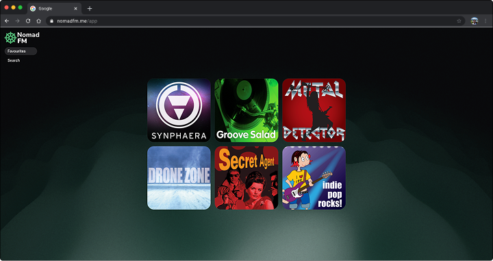

<p align="center">
  
</p>

<p align="center">
  <b>Your last next music app.</b><br>
  A radio player that gets out of your way: your favourite stations as tiles, music without ads or noise.
</p>

<p align="center">
  
  
  
  
  
  
</p>

---

## 📻 About the app

**Nomad FM** is a minimal web player for internet radio. No accounts, no ads, no "smart" algorithms: open it, tap a tile, listen.

<p align="center">
  
</p>

### Features

- **🎛 Preset tiles** — your favourite stations as a grid of square covers. Ships with six SomaFM stations, then the grid becomes yours.
- **🔍 Radio Browser search** — thousands of stations from around the world, by name or by popular tags (ambient, jazz, rock…). Found one? Add it to your presets in a single tap.
- **🌊 Living waves** — the player's backdrop is a WebGL shader (GradientWaves). Wave colors adapt to the cover of the station currently playing: dominant colors are extracted from the artwork right in the browser.
- **▶️ Fullscreen player** — cover art on the whole screen, play/pause, volume, cancel while connecting, stream errors surfaced clearly.
- **✏️ Your own stations** — edit any tile: title, cover, direct stream URL (mp3/aac).
- **💾 Everything in the browser** — presets are stored in `localStorage`. No accounts, no sign-ups.
- **🎨 Dark theme** — responsive UI: sidebar on desktop, bottom navigation on mobile.

The monorepo also hosts the **landing page** (`apps/landing`) — a showcase with animated waves, live station data, and CTAs pointing at the app.

---

## 🛠 Tech

A **pnpm workspaces** monorepo: two Vite apps.

```
nomadfm/
├─ apps/
│  ├─ mainapp/                  # radio player (web + desktop shell)
│  │  ├─ src/
│  │  │  ├─ components/         # UI (shadcn) + GradientWaves + screens
│  │  │  ├─ hooks/              # useRadioPlayer, useTiles
│  │  │  └─ lib/                # SomaFM / Radio Browser APIs, color utils
│  │  ├─ src-tauri/             # Tauri v2 desktop shell (same React app)
│  │  └─ flatpak/               # Flatpak manifest used by CI
│  └─ landing/                  # landing page
└─ readmeResources/             # images for this README
```

### Stack

| Layer           | Technology                                                       |
| --------------- | ---------------------------------------------------------------- |
| Framework       | React 19 + TypeScript                                            |
| Build           | Vite 8, React Compiler, ESLint                                   |
| Styling         | Tailwind CSS 4 + shadcn/ui (Base UI primitives, HugeIcons icons) |
| Animations      | framer-motion, GradientWaves (WebGL, ogl)                        |
| Data            | SomaFM API (channels + `.pls` → direct streams), Radio Browser API |
| Storage         | localStorage (`nomadfm:tiles`)                                   |

### Quick start

```bash
pnpm install

# App → http://localhost:5173
pnpm --dir apps/mainapp dev

# Landing → http://localhost:5174 (if mainapp is already running)
pnpm --dir apps/landing dev
```

### Scripts

| Command                              | Action                                       |
| ------------------------------------ | -------------------------------------------- |
| `pnpm --dir apps/mainapp dev`        | dev server for the app                       |
| `pnpm --dir apps/mainapp build`      | production build (`tsc -b && vite build`)    |
| `pnpm --dir apps/mainapp lint`       | ESLint                                       |
| `pnpm --dir apps/landing dev`        | dev server for the landing                   |
| `pnpm --dir apps/landing build`      | production build of the landing              |
| `pnpm --dir apps/mainapp tauri dev`  | desktop app with HMR (needs Rust)            |
| `pnpm --dir apps/mainapp tauri build`| desktop bundle (deb/rpm on Linux, msi/nsis on Windows) |

### Environment variables

| Variable          | Where           | Purpose                                                        |
| ----------------- | --------------- | -------------------------------------------------------------- |
| `VITE_APP_URL`    | `apps/landing`  | Where the landing CTAs ("Turn it on") point; defaults to `http://localhost:5173` |

---

## 🖥 Desktop app (Tauri)

The same React app runs as a desktop app via **Tauri v2** (`apps/mainapp/src-tauri`). The web build is untouched: the desktop bundle only switches Vite's `base` to relative paths when `TAURI_ENV_PLATFORM` is set (Tauri CLI does this automatically).

Releases are produced by `.github/workflows/release.yml` on tags `v*` (or manually via *Actions → Release desktop apps*): **Windows** installers (`msi` + `nsis`) and a **Flatpak** bundle, both uploaded to GitHub Releases. Remember to bump `version` in `apps/mainapp/src-tauri/tauri.conf.json` before tagging.

---

<p align="center">
  <sub>Made with ♥ and good sound. ISC licensed.</sub>
</p>
